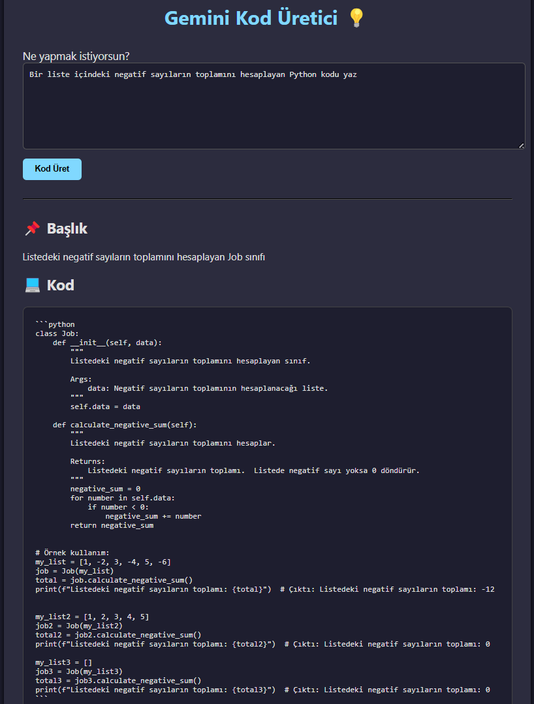

# 🧠 Gemini Kod Üretici (AI Code Assistant)

Bu proje, Google Gemini API kullanarak yapay zekâ destekli Python kodları üreten basit bir web uygulamasıdır.  
Kullanıcıdan alınan prompt'a göre `Job` sınıfına uygun Python kodu ve başlığı üretir.

---

## 🚀 Özellikler

- Gemini 1.5 Flash modeli ile API tabanlı kod üretimi
- Flask ile hazırlanmış basit ama modern web arayüzü
- Kod ve başlığı ayrıştırarak ayrı ayrı görüntüleme
- Docker container olarak çalışabilir
- Kubernetes (Minikube) üzerinde dağıtılabilir yapı

---

## 🧰 Kurulum (Lokal Geliştirme)

### 1. Gerekli Kütüphaneler

```bash
pip install -r requirements.txt
```

### 2. `.env` Dosyası Oluştur

```env
GEMINI_API_KEY=YOUR_GEMINI_API_KEY
```

### 3. Uygulamayı Başlat

```bash
python app.py
```

Tarayıcıda şu adrese gidin:  
👉 http://localhost:5000

---

## 🐳 Docker ile Çalıştırma

```bash
docker build -t gemini-codegen .
docker run -p 5000:5000 --env-file .env gemini-codegen
```

---

## ☸️ Minikube ile Dağıtım

```bash
minikube start
minikube image load gemini-codegen

kubectl apply -f deployment.yaml
kubectl apply -f service.yaml

minikube service gemini-service --url
```

---

## ✨ Ekran Görüntüsü



---

## 💡 Örnek Prompt

```
Bir dosyadaki satır sayısını hesaplayan Python kodunu yaz.
```

---

## 📁 Proje Yapısı

```
.
├── app.py
├── generate.py
├── templates/
│   └── index.html
├── Dockerfile
├── deployment.yaml
├── service.yaml
├── .env (lokal için)
├── requirements.txt
└── README.md
```

---

## 👨‍💻 Geliştirici

- 👤 [zmrklc1](https://github.com/zumreKilic)

---
